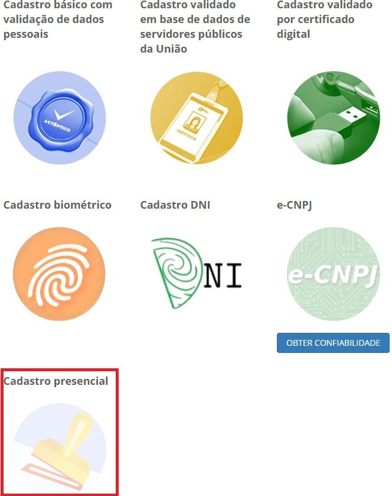

Conceito
========

O módulo balcão do Login Único permite ao órgão atribuir uma maior segurança por meio de confirmação, presencialmente, de outras informações do cidadão.

Ocorre a atribuição do Selo Cadastro Presencial (Nível 3)

.. |site externo| image:: _images/site-ext.gif
    