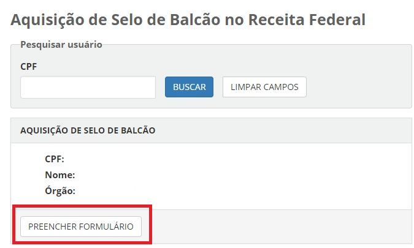

Coletar os documentos apresentados no balcão (Aquisição Selo Balcão)
===================================================================

Para os balconistas coletarem os documentis e atribuirem o selo Balcão, o usuário balconista deve acessar o `Balcao`_.

Passos para Aquisição do Selo Balcão:

1. Selecione o item de menu **Aquisição de Selo de Balcão** e pesquisa o cidadão deseja atribuir o selo. A pesquisa pode ser feita por **CPF**:

2. Confira as informações do cidadão e clique no botão "Preencher Formulário".

3. Confira as informações, preencha os campos e clique no botão **Adquirir Selo de Balcão**

.. _`Balcao`: https://balcao.brasilcidadao.gov.br/balcao
.. |site externo| image:: _images/site-ext.gif
    