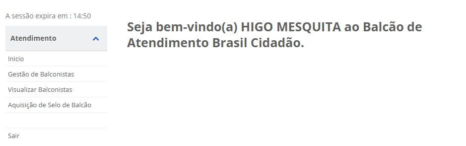
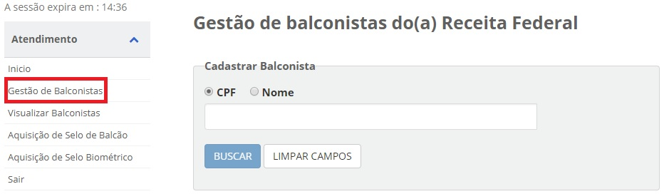
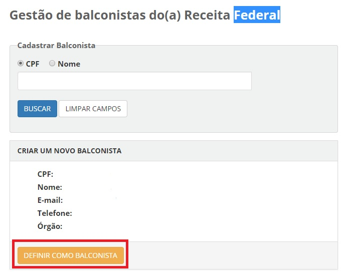

Cadastro de Balconista
======================

Para cadastrar os balconistas que irão efetivamente coletar os dados dos cidadãos interessados em adquirir o selo Balcão, o usuário gestor ou o usuário balconista cadastrador deve acessar o `Balcao`_.

Passos para cadastramento de balconistas:

1. Selecione o item de menu **Gestão de Balconistas** e pesquisa o cidadão deseja cadastrar. A pesquisa pode ser feita por **CPF** ou **Nome**:

2. Confira as informações do balconista e clique no botão "Definir como Balconista" 

   
.. _`Balcao`: https://balcao.brasilcidadao.gov.br/balcao
.. |site externo| image:: _images/site-ext.gif
    