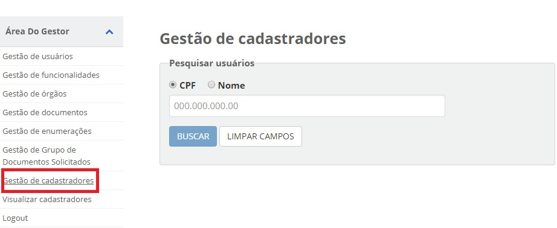
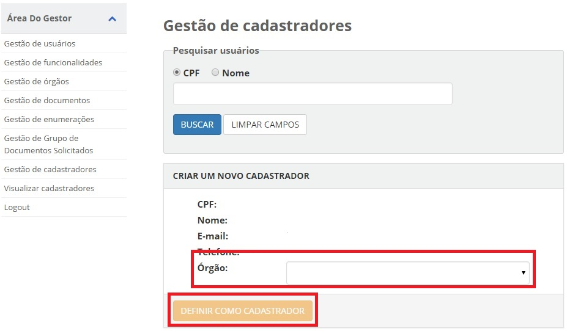

Cadastro de Balconistas Gestores
================================

1. Acesse o `Módulo Gestor`_ e selecione o item **Gestão de Cadastradores**. 

2. Na busca, escolha o CPF ou Nome e clique no botão "Buscar";

3. Selecione o orgão a qual o usuário será vinculado e clique no botão "Definir como Cadastrador"

.. |site externo| image:: _images/site-ext.gif
.. _`Módulo Gestor`: https://gestao.brasilcidadao.gov.br/servicos-gestor   