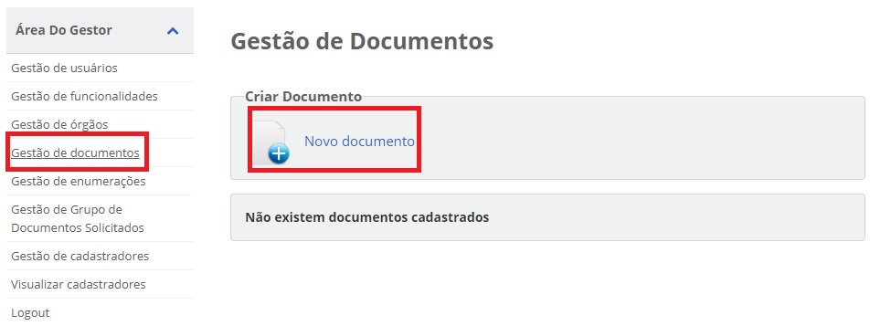
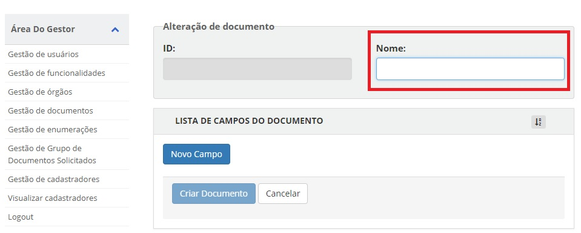
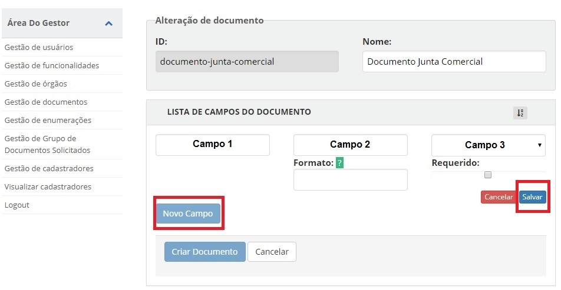
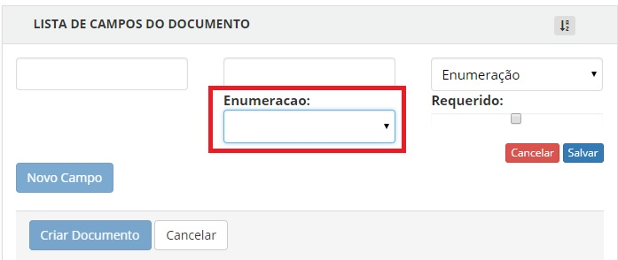
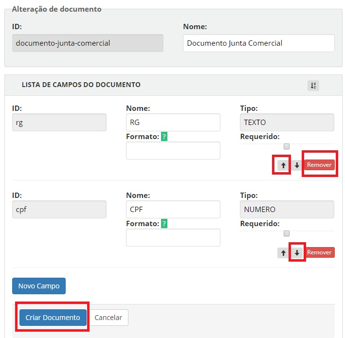

Cadastro de Documentos
======================

O cadastro de documentos engloba as atividades:

- Escolha dos documentos exigidos pelo balcão do órgão;
- Cadastro de novos documentos;
- Modificação de documentos já existentes;
- Exclusão de documentos cadastrados.

Todas as atividades acima são exclusivas do **usuário gestor** 

Passos para cadastramento:

1. Acesse o `Módulo Gestor`_ e selecione o item **Gestão de Documentos** e clique na opção "Novo Documento"

2. Digite a identificação do documento no campo **Nome**. O campo **ID** será preenchido de forma automática pelo sistema.

3. Clique no botão "Novo Campo" para inserir quais os documentos serem exigidos no balcão do órgão. Após o preenchimento, digite o botão "Salvar".

   
Detalhe de cada campo:

- **Campo 1**: Identificador do campo do documento ser requerido no balcão. Este é utilizado nas integrações do sistemas para buscarem a informação do campo. O preenchimento é automático pelo sistema.
- **Campo 2**: Nome do Campo do documento ser requerido no balcão;
- **Campo 3**: Tipo do Campo do documento ser requerido no balcão. Podendo ser **Arquivo** (Upload de documentos); **Campo Textual** (letras e números); **Data** ; **Hora**; **Número**; **Enumeração** (Conteúdo com lista de valores. A forma de cadastro está na opção `Gestão de enumerações`_); **Assinatura** (Informa que area deverá ter assinatura por certificado digital)
- **Formato**: Determina a forma de visualização (máscara) para campo do documento. Está disponível para os tipos de campo: **Campo Textual**, **Data**, **Hora**, **Número**;     
- **Enumeração**: Seleciona a lista de valores a ser preenchida no campo;
- **Requerido**: Determina se o campo será obrigatório ou não.

3. Para finalizar o cadastramento do documento, basta clicar no botão "Criar Documento". Para cancelar o campo, basta clicar no botão "Remover" e para ordenar os campos no documento, clique nas setas baixo ou cima.

    
   

.. _`Módulo Gestor`: https://gestao.brasilcidadao.gov.br/servicos-gestor     
.. |site externo| image:: _images/site-ext.gif
.. _`Gestão de enumerações`: gestaoenumeracao.html    