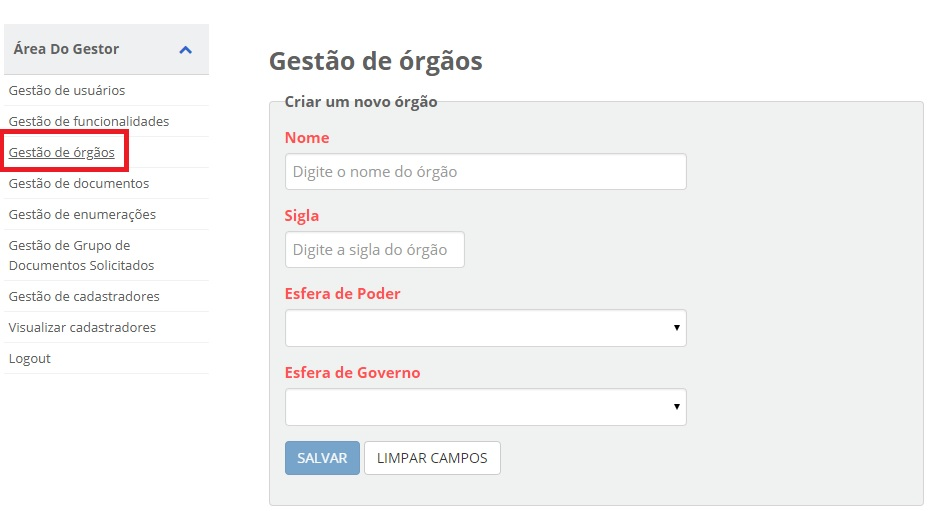

Cadastro do Orgão
=================

A utilização do balcão depende do cadastramento do õrgão para vincular os usuários.

1. Acesse o `Módulo Gestor`_ e selecione o item **Gestão de Órgãos**;

  
2. Após digitar todos os campos, clicar no botão "Salvar";

3. Na listagem dos órgãos permite a exclusão  no botão "Remover".

.. figure:: _images/ tela_cadastro_orgao_botao_remover.jpg
   :align: center
   :alt:
 
.. _`Módulo Gestor`: https://gestao.brasilcidadao.gov.br/servicos-gestor
 
.. |site externo| image:: _images/site-ext.gif
    