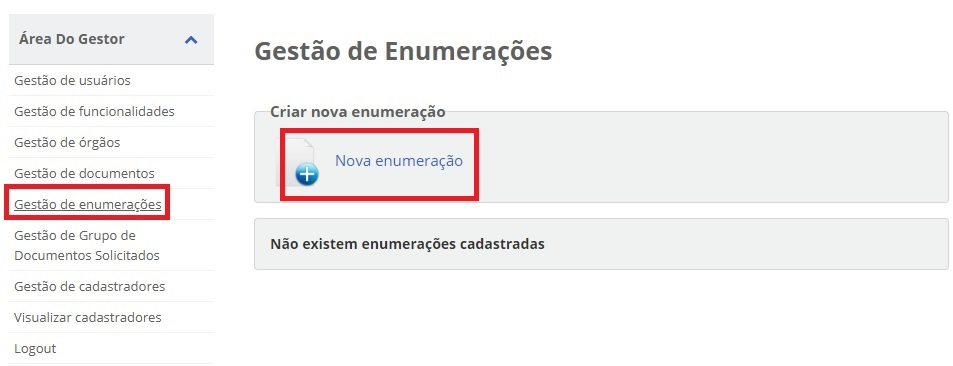
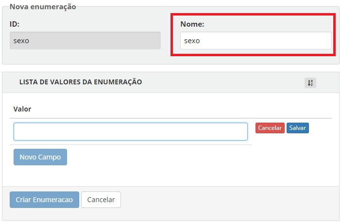
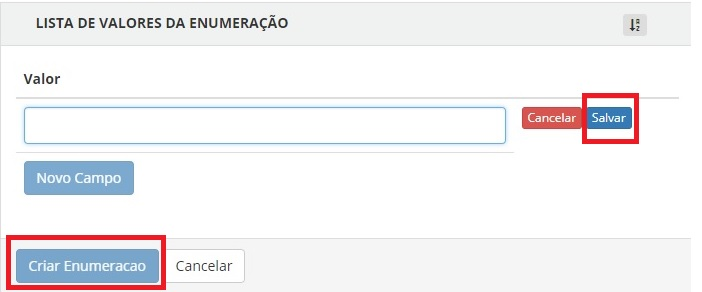
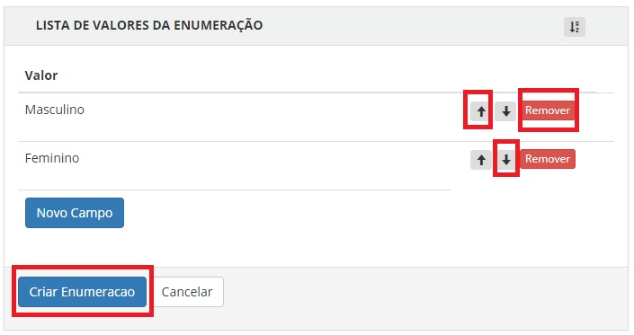

Cadastro de Enumeração
======================

Enumeração são campos que possuen listas pré definidas de valores serem selecionados nos campos do balcão.

Passos para cadastramento:

1. Acesse o `Módulo Gestor`_ e selecione o item **Gestão de Enumerações** e clique na opção "Novo Enumeração";

  
2. Digite a identificação da enunmeração no campo **Nome**. O campo **ID** será preenchido de forma automática pelo sistema.

3. Clique no botão "Novo Campo" para inserir quais conteúdos a serem preenchidos na enumeraeção. Após o preenchimento, digite o botão "Salvar".

   
4. Para finalizar o cadastramento da enumeração, basta clicar no botão "Criar Enumeração". Para cancelar o campo, basta clicar no botão "Remover" e para ordenar os campos, clique nas setas baixo ou cima.   

.. _`Módulo Gestor`: https://gestao.brasilcidadao.gov.br/servicos-gestor     
.. |site externo| image:: _images/site-ext.gif
    