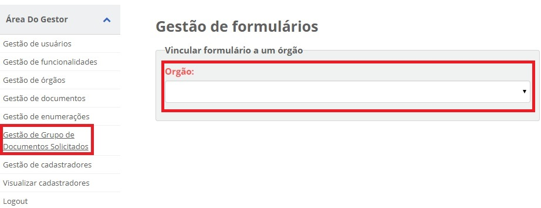
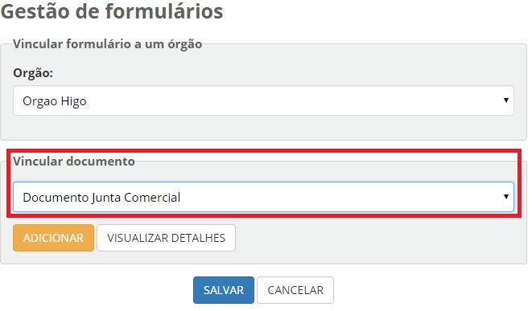
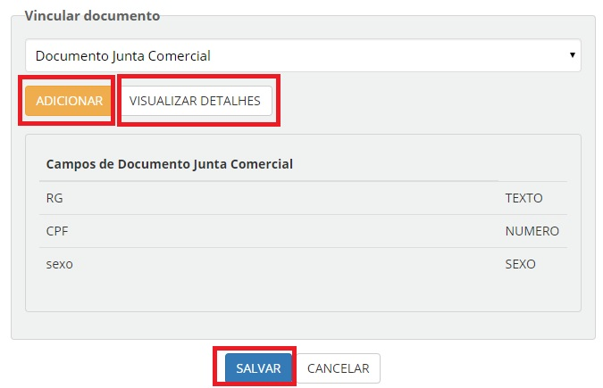

Gestão de Documentos Solicitados
================================

Passos para inserir documento criado ao órgão que o manipulará

1. Acesse o `Módulo Gestor`_ e selecione o item **Gestão de Grupo de Documentos Solicitados** e selecione o órgão desejado;

2. Selecione o documento ser vinculado no campo "Vincular Documento" 

 
3. Para finalizar o cadastramento do documento, basta clicar no botão "Adicionar". Para listar quais campos estão no documento, basta clicar no botão "Visualizar Detalhes"

 
.. _`Módulo Gestor`: https://gestao.brasilcidadao.gov.br/servicos-gestor  
.. |site externo| image:: _images/site-ext.gif
    